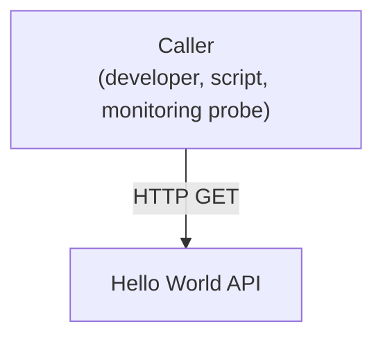
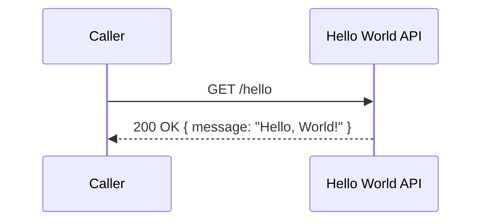

## Overview

The Hello World API is a single, stateless backend service exposed publicly
on the internet. It serves one purpose: respond to a request with a fixed
"Hello, World!" greeting, giving callers a trivially simple, always-available
endpoint to verify connectivity to a new environment or integration pipeline.
It requires no authentication, holds no data, and calls no other system.

## Context (C1)

## Domain model (ER)

No persistent entities exist in this system — the API is stateless and holds
no data.

## Key flows

